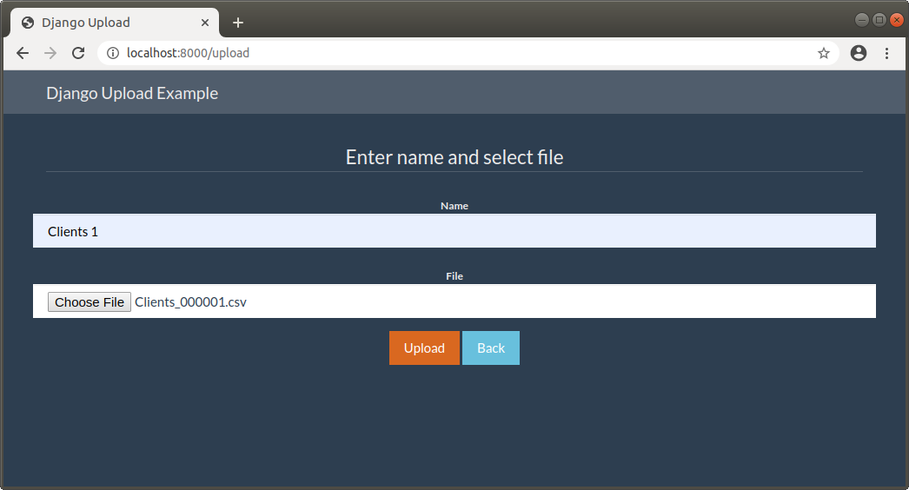
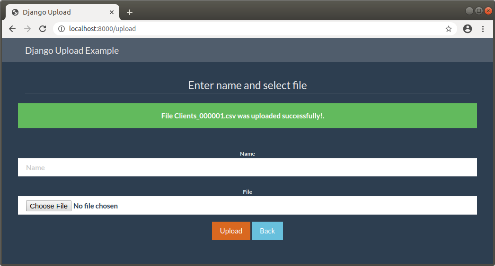
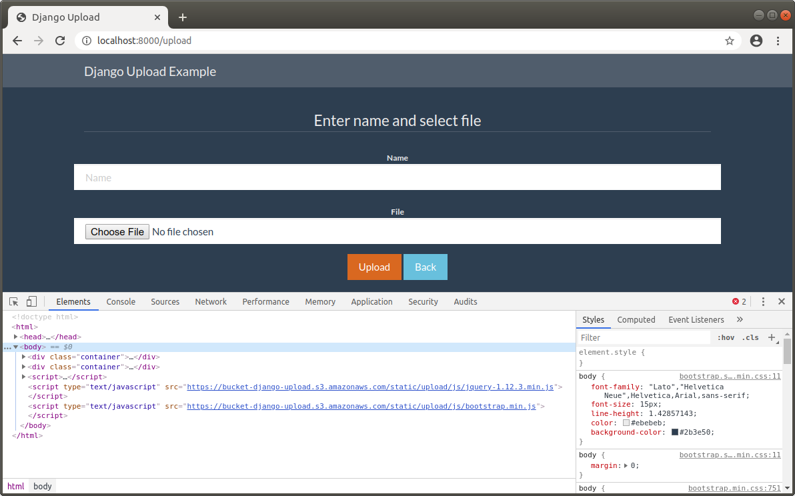
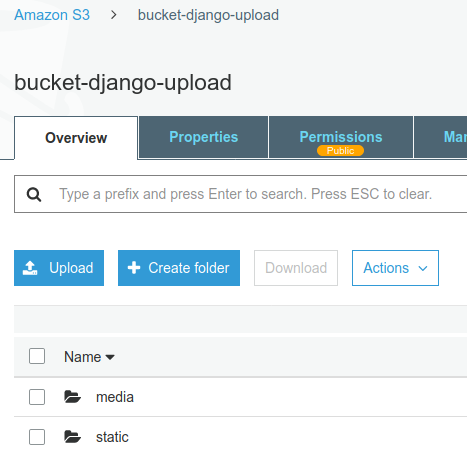

DJANGO UPLOAD WITH AWS S3
---------------------------------------------------------------------------------------------------------------------------

Aplicación desarrollada con Django 2.2 que muestra ejemplo de upload.
Los archivos que se suben, al igual que los archivos estáticos utilizados por la aplicación,
son almacenados en un bucket de AWS S3.

---------------------------------------------------------------------------------------------------------------------------

Configuración para archivos estáticos y upload de archivos:

```

AWS_ACCESS_KEY_ID = env('ACCESS_KEY_ID')
AWS_SECRET_ACCESS_KEY = env('SECRET_ACCESS_KEY')
AWS_STORAGE_BUCKET_NAME = env('STORAGE_BUCKET_NAME')
AWS_S3_CUSTOM_DOMAIN = '%s.s3.amazonaws.com' % AWS_STORAGE_BUCKET_NAME
AWS_S3_OBJECT_PARAMETERS = {
    'CacheControl': 'max-age=86400',
}
AWS_LOCATION = 'static'

AWS_DEFAULT_ACL = None

STATICFILES_DIRS = [
    os.path.join(BASE_DIR, 'upload_aws/static'),
]
STATIC_URL = 'https://%s/%s/' % (AWS_S3_CUSTOM_DOMAIN, AWS_LOCATION)
STATICFILES_STORAGE = 'storages.backends.s3boto3.S3Boto3Storage'
DEFAULT_FILE_STORAGE = 'upload_aws.storage_backends.PublicMediaStorage'

```

---------------------------------------------------------------------------------------------------------------------------

**Upload de archivo:**



---------------------------------------------------------------------------------------------------------------------------

**Mensaje de retorno de un upload exitoso:**



---------------------------------------------------------------------------------------------------------------------------


**Se recuperan archivos estáticos desde Bucket S3 en AWS:**



---------------------------------------------------------------------------------------------------------------------------

**Contenido del Bucket S3 en AWS:**



---------------------------------------------------------------------------------------------------------------------------
